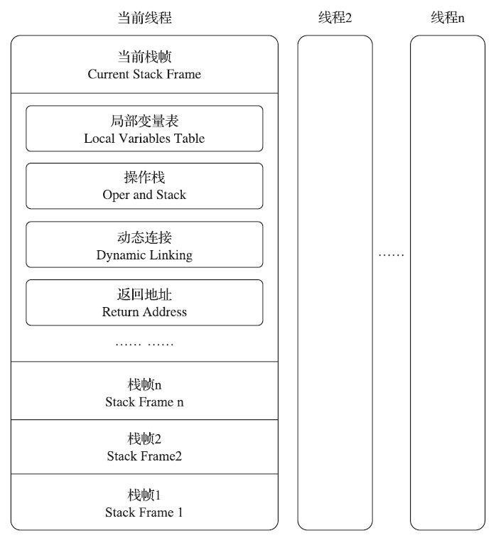
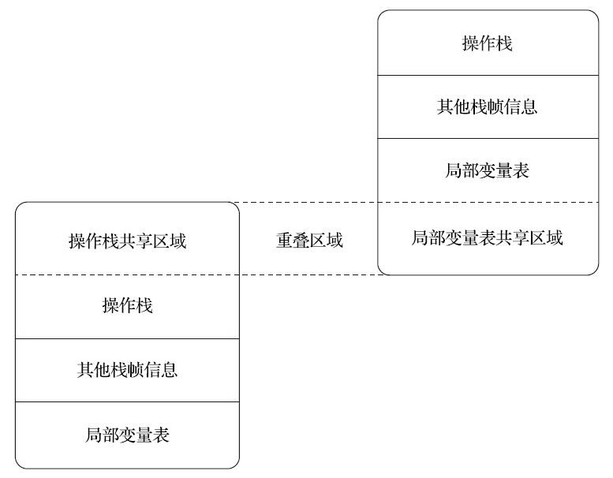

## 8.虚拟机字节码执行引擎

### 8.1运行时栈帧结构

#### PRE

:one: Java虚拟机以方法作为最基本的执行单元，“栈帧”（Stack Frame）则是用于支持虚拟机进行方法调用和方法执行背后的数据结构，它也是虚拟机运行时数据区中的虚拟机栈（Virtual MachineStack）的栈元素。

:two: 栈帧存储了方法的局部变量表、操作数栈、动态连接和方法返回地址等信息

:three: 在活动线程中，只有位于栈顶的方法才是在运行的，只有位于栈顶的栈帧才是生效的，其被称为“当前栈帧”（Current Stack Frame），与这个栈帧所关联的方法被称为“当前方法”（Current Method）

:four: 栈帧结构



#### 8.1.1局部变量表

##### 1）定义

局部变量表（Local Variables Table）是一组变量值的存储空间，用于**存放方法参数和方法内部定义的局部变量**。在Java程序被编译为Class文件时，就在方法的Code属性的max_locals数据项中确定了该方法所需分配的局部变量表的**最大容量**。

> 局部变量表中除了存放基本类型的数据，还会存放一个**reference类型**的数据，代表对象实例的引用，通过这个引用实现对堆或方法区中存储信息直接或间接地访问

##### 2）参数传递时机

在方法被调用时，就会进行局部变量表中的参数值到参数列表传递的过程，也即实参到形参的传递。

##### 3）slot的重用与回收

###### （1）重用规则

由于方法中的每个局部变量都有**不同的作用域**，当**超出作用域时**，占用的slot就会被闲置，此时可以将**此slot用其他变量来占用**实现slot的重用。

###### （2）对GC的影响

正因为重用，只要slot没有被新的变量重用，不论原变量是否超出作用域，如果此时没有进行即时编译，那么slot中的变量就不会得到回收。

> 尽管通过设置为**null**的方式也可以触发GC来完成变量回收，但是**真正的解决办法应为控制好变量的作用域**

#### 8.1.2操作数栈

##### 1）定义

操作数栈（Operand Stack）也常被称为操作栈，它是一个**后入先出**（Last In First Out，LIFO）栈。同局部变量表一样，操作数栈的最大深度也在编译的时候被写入到Code属性的max_stacks数据项之中。

##### 2）减少值传递

为了**加速方法调用**，可以在方法调用时就可以和局部变量表直接**共用**一部分数据，这样就无须进行**额外的参数复制传递**，如下所示



##### 8.1.3 动态连接

通过静态解析或动态连接，可以将class常量池中的符号引用转化为直接引用，对应于类加载过程中的连接步骤中的解析过程

##### 8.1.4 方法返回地址

在方法退出之后，都**必须返回到最初方法被调用时的位置**，程序才能继续执行，方法返回时可能需要在栈帧中保存一些信息，用来帮助恢复它的上层主调方法的执行状态。

### 8.2 方法调用

#### 8.2.1解析(Resolution)

##### 1）定义

对"编译器可知，运行期不可变"的方法的调用即为解析，这类方法包括静态方法，私有方法，实例构造器`<init>()`和父类方法，这些方法也叫做非虚方法。此类方法不存在多态的情况(通过重载和父子类间重写实现)。

这类方法会在编译时以常量池项的形式固化到字节码指令的参数中

##### 2）方法调用字节码指令

:one: invokestatic。用于调用静态方法。
:two: invokespecial。用于调用实例构造器`<init>()`方法、私有方法和父类中的方法。
:three: invokevirtual。用于调用所有的虚方法。
:four: invokeinterface。用于调用接口方法，会在运行时再确定一个实现该接口的对象。

> final修饰的方法尽管使用invokevirtual调用，但是在运行期也是不可变的，因为不能被重写

#### 8.2.2分派(Dispatch)

##### 1）静态分派--重载

下面先通过一个例子来解释静态类型和实际类型

```java
public class ActualType {
    
        static abstract class Human {
        }
        static class Man extends Human {
        }
        static class Woman extends Human {
        }
    
        public void sayHello(Human guy) {
            System.out.println("hello,guy!");
        }
        public void sayHello(Man guy) {
            System.out.println("hello,gentleman!");
        }
        public void sayHello(Woman guy) {
            System.out.println("hello,lady!");
        }
    
        public static void main(String[] args) {
            Human man = new Man();
            Human woman = new Woman();
            ActualType sr = new ActualType();
            sr.sayHello(man);
            sr.sayHello(woman);
            // 实际类型变化
            Human human = (new Random()).nextBoolean() ? new Man() : new Woman();
            // 静态类型变化
            sr.sayHello((Man) man);
            sr.sayHello((Woman) woman);
        }
}
```

运行结果如下

```text
hello,guy!
hello,guy!
hello,gentleman!
hello,lady!
```

观察`sr.sayHello(man);` `sr.sayHello(woman);`两句可以发现没有调用重载的两个sayHello方法，反而调用的是参数为Human的sayHello方法。这是由于在编译期，man和woman这两个引用**都是Human类型**，因而通过这两个参数实现方法调用会被**编译为**使用参数为Human的来实现调用。

对于后面的两句`sr.sayHello((Man) man);` `sr.sayHello((Woman) woman);`，其使用了**强制类型转换**将类型转为Man和Woman，这时编译期就会将这两个方法的调用编译为重载的类型。

此外，对于`Human human = (new Random()).nextBoolean() ? new Man() : new Woman();`这一句，其最终创建出的类型是不确定的，但是如果直接使用human作为参数调用sayHello，仍然调用的是Human类型的方法

通过上面的例子，我们可以将这样的现象归因于静态类型和实际类型

###### （1）静态类型（Static Type或Apparent Type）

对应于上面例子中的Human类

###### （2）实际类型（Actual Type或Runtime Type）

对应于上面例子中的Woman和Man类

**--- 下面进一步作出解释 ---**

尽管上面的man和woman参数的实际类型是Man和Woman，但是方法重载的确定关系是在编译期决定的，由于**编译器只会通过静态类型来作为重载方法的区分标志**，所以，会产生上面的现象。也称**重载为编译期行为**

***上述也即静态分派的定义***

> 额外的重载例子见[附](###附)

##### 2）动态分派--重写

同样通过一个例子来观察

```java
public class DynamicDispatch {
    static abstract class Human {
    protected abstract void sayHello();
    }
    static class Man extends Human {
        @Override
        protected void sayHello() {
            System.out.println("man say hello");
        }
    }
    static class Woman extends Human {
        @Override
        protected void sayHello() {
            System.out.println("woman say hello");
        }
    }
    public static void main(String[] args) {
        Human man = new Man();
        Human woman = new Woman();
        man.sayHello();
        woman.sayHello();
        man = new Woman();
        man.sayHello();
    }
}
```

运行结果如下

```text
man say hello
woman say hello
woman say hello
```

这个运行结果是由重写带来的多态引起的，同时，由于此类方法不是在编译期进行确定的，属于虚方法，所以通过invokevirtual来实现，invokevirtual的**执行步骤如下，可以更好的反应出重写实现的多态规则**：

:one: 找到操作数栈顶的第一个元素所指向的对象的实际类型，记作C
:two: 如果在类型C中找到与常量中的描述符和简单名称都相符的方法，则进行访问权限校验，如果通过则返回这个方法的直接引用，查找过程结束；不通过则返回java.lang.IllegalAccessError异常
:three: 否则，按照继承关系从下往上依次对C的各个父类进行第二步的搜索和验证过程
:four: 如果始终没有找到合适的方法，则抛出java.lang.AbstractMethodError异常

此外由于invokevirtual**并不能适用于字段，所以也就不存在字段的重写**。

> 关于字段不参与多态的例子见[附](###附)

##### 3）单分派与多分派

同样通过例子解释

```java
/**
* 单分派、多分派演示
* @author zzm
*/
public class Dispatch {
    static class QQ {}
    static class _360 {}
    public static class Father {
        public void hardChoice(QQ arg) {
            System.out.println("father choose qq");
        }
        public void hardChoice(_360 arg) {
            System.out.println("father choose 360");
        }
    }
    public static class Son extends Father {
        public void hardChoice(QQ arg) {
            System.out.println("son choose qq");
        }
        public void hardChoice(_360 arg) {
            System.out.println("son choose 360");
        }
    }
    public static void main(String[] args) {
        Father father = new Father();
        Father son = new Son();
        father.hardChoice(new _360());
        son.hardChoice(new QQ());
    }
}
```

运行结果如下

```text
father choose 360
son choose qq
```

可以看出在使用father调用方法时首先判定father的实际类型为Father且参数的静态类型为_360，所以会调用父类的对应方法；而在使用son调用方法时，首先判定son的实际类型为Son且参数的静态类型为QQ，所以会调用子类的对应方法

从上面可以看出，进行动态分派时是要**唯一确定**一个实际类型，而静态分派时是根据参数的静态类型的不同可以**执行多个**重载的方法。总结下来为**动态单分派，静态多分派**

> 这里要注意，Java中的var仍然是以等号右侧的表达式类型来推断静态类型，而不是在运行期实现多态

### 8.3 动态类型支持

> 这里只讨论invoke包和reflection包的区别

#### 8.3.1 MethodHandle实现动态调用

同样通过一个例子来了解invoke包动态调用的机制

```java
import static java.lang.invoke.MethodHandles.lookup;
import java.lang.invoke.MethodHandle;
import java.lang.invoke.MethodType;
/**
* JSR 292 MethodHandle基础用法演示
* @author zzm
*/
public class MethodHandleTest {
    static class ClassA {
        public void println(String s) {
            System.out.println(s);
        }
    }
    public static void main(String[] args) throws Throwable {
        Object obj = System.currentTimeMillis() % 2 == 0 ? System.out : new ClassA();
        // 无论obj最终是哪个实现类，下面这句都能正确调用到println方法。
        getPrintlnMH(obj).invokeExact("icyfenix");
    }
    private static MethodHandle getPrintlnMH(Object reveiver) throws Throwable {
        // MethodType：代表“方法类型”，包含了方法的返回值（methodType()的第一个参数）和
        //具体参数（methodType()第二个及以后的参数）。
        MethodType mt = MethodType.methodType(void.class, String.class);
        // lookup()方法来自于MethodHandles.lookup，这句的作用是在指定类中查找符合给定的方法
        //名称、方法类型，并且符合调用权限的方法句柄。
        // 因为这里调用的是一个虚方法，按照Java语言的规则，方法第一个参数是隐式的，代表该方法的接
        //收者，也即this指向的对象，这个参数以前是放在参数列表中进行传递，现在提供了bindTo()
        //方法来完成这件事情。
        return lookup().findVirtual(reveiver.getClass(), "println", mt).bindTo(reveiver);
    }
}
```

方法getPrintlnMH()中实际上是模拟了invokevirtual指令的执行过程，只不过它的分派逻辑并非固化在Class文件的字节码上，而是通过一个由用户设计的Java方法来实现。其返回的MethodHandle类型的变量称为**方法句柄**，这是实现动态确定目标方法的机制

#### 8.3.2与反射的区别

Reflection和MethodHandle机制本质上都是在模拟方法调用，但是Reflection是在**模拟**Java**代码层次**的方法调用，而MethodHandle是在**模拟字节码层次**的方法调用，相对来说，后者会更轻量

---

### 附

#### 1.重载例子

```java
public class Overload {
    public static void sayHello(Object arg) {
    System.out.println("hello Object");
    }
    public static void sayHello(int arg) {
    System.out.println("hello int");
    }
    public static void sayHello(long arg) {
    System.out.println("hello long");
    }
    public static void sayHello(Character arg) {
    System.out.println("hello Character");
    }
    public static void sayHello(char arg) {
    System.out.println("hello char");
    }
    public static void sayHello(char... arg) {
    System.out.println("hello char ...");
    }
    public static void sayHello(Serializable arg) {
    System.out.println("hello Serializable");
    }
    public static void main(String[] args) {
    sayHello('a');
    }
}
```

上面的重载顺序如下

char>int>long>(float>double)Character>Serializable>Object>char...

可以看出基本类型优先级>包装类>实现接口>父类>可变长参数

ps：可变长参数中不可以实现诸如char到int的基本类型转型

#### 2.字段不参与多态的例子

```java
/**
* 字段不参与多态
* @author zzm
*/
public class FieldHasNoPolymorphic {
    static class Father {
        public int money = 1;
        public Father() {
            money = 2;
            showMeTheMoney();
        }
        public void showMeTheMoney() {
            System.out.println("I am Father, i have $" + money);
        }
    }
    static class Son extends Father {
        public int money = 3;
        public Son() {
            money = 4;
            showMeTheMoney();
        }
        public void showMeTheMoney() {
            System.out.println("I am Son, i have $" + money);
        }
    }
    public static void main(String[] args) {
        Father guy = new Son();
        System.out.println("This guy has $" + guy.money);
    }
}
```

运行结果如下

```text
I am Son, i have $0
I am Son, i have $4
This gay has $2
```

其中在调用子类构造器时会先调用父类构造器，而父类构造器中调用的方法在子类中进行了重写，所以调用的是子类的方法，由此也可以看出invokevirtual指令的作用


