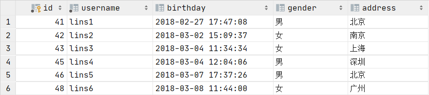

# Mybatis学习

---

# 1. Mybatis框架概述

##  1.1基本概念

### 1.1.1什么是框架

在编程领域，软件框架是指一种抽象形式，它提供了一个具有通用功能的软件，这些功能可以由使用者编写代码来有选择的进行更改，从而提供服务于特定应用的软件。软件框架提供了一种标准的方式来构建并部署应用。

软件框架是一种通用的、可复用的软件环境，它提供特定的功能，作为一个更大的软件平台的一部分，用以促进软件应用、产品和解决方案的开发工作。软件框架可能会包含支撑程序、编译器、代码、库、工具集以及 API，它把所有这些部件汇集在一起，以支持项目或系统的开发。

> 引自https://insights.thoughtworks.cn/what-is-software-framework/

### 1.1.2框架的作用

由于框架的存在，可以将平时冗余重复的代码抽离出并放入框架，这样在编写代码时可以更注重于功能和业务本身，大大提高了开发效率。又得益于Java中的反射机制，使得框架的开发更便捷。

### 1.1.3什么是Mybatis框架

#### 1）[官方定义](https://mybatis.org/mybatis-3/zh/index.html)

> *MyBatis 是一款优秀的**持久层框架**，它支持**自定义 SQL、存储过程以及高级映射**。MyBatis 免除了几乎所有的 **JDBC 代码**以及**设置参数**和**获取结果集**的工作。MyBatis 可以通过简单的 **XML 或注解**来配置和映射原始类型、接口和 Java POJO（Plain Old Java Objects，普通老式 Java 对象）为数据库中的记录。*

#### 2）ORM(Object-relational mapping)

ORM通过其名称可以看出是“对象”和“关系”的映射，对象代表着所有面向对象语言中的对象，关系代表关系型数据库中的数据。由于两者天然的存在类似性，我们可以举例如下：

- 类 对应于 表的定义
- 对象 对应于 表中的记录

ORM要解决的问题是如何将以对象存储的数据和以表中的记录存储的数据之间进行**互相转换**。

#### 3）Mybatis为什么不是完全的ORM框架

ORM是Object和Relation之间的映射，包括Object->Relation和Relation->Object**两方面**。Hibernate是个完整的ORM框架，**而MyBatis完成的是Relation->Object，也就是其所说的Data Mapper Framework**。

JPA是ORM框架标准，主流的ORM框架都实现了这个标准。MyBatis**没有实现JPA**(Java Persistence API)，它和ORM框架的设计思路不完全一样。MyBatis是拥抱SQL，而ORM则更靠近面向对象，不建议写SQL，实在要写，则推荐你用框架自带的类SQL代替。MyBatis是SQL映射框架而不是ORM框架，当然**ORM和MyBatis都是持久层框架**。

最典型的ORM 框架是Hibernate，它是全自动ORM框架，而MyBatis是**半自动的**。Hibernate完全可以通过对象关系模型实现对数据库的操作，拥有完整的JavaBean对象与数据库的映射结构来自动生成SQL。而MyBatis仅有基本的字段映射，对象数据以及对象实际关系仍然需要通过手写SQL来实现和管理。

Hibernate数据库移植性远大于MyBatis。Hibernate通过它强大的映射结构和HQL语言，大大降低了对象与数据库（oracle、mySQL等）的耦合性，而MyBatis由于需要手写SQL，因此与数据库的耦合性直接取决于程序员写SQL的方法，如果SQL不具通用性而用了很多某数据库特性的SQL语句的话，移植性也会随之降低很多，成本很高。

总而言之，Mybatis支持我们手写sql，并对sql进行优化，框架所完成的部分，其实是除了手写sql和执行sql之外的所有部分(如获取连接、准备PreparedStatement对象等)，其最大的贡献是完成了关系型数据库中的**记录到POJO的映射**

> 由于Mybatis没有想Hibernate强大的日志功能，通常引入log4j来解决这个问题

## 1.2入门案例

### 1.2.1 引入Mybatis依赖

```xml
<dependency>
    <groupId>org.mybatis</groupId>
    <artifactId>mybatis</artifactId>
    <version>3.5.5</version>
</dependency>
```

### 1.2.2 创建数据库

表格如下



### 1.2.3 编写POJO

```java
public class User implements Serilizable {
    private Integer id;
    private String username;
    private Date birthday;
    private String gender;
    private String address;

    @Override
    public String toString() {
        return "User{" +
                "id=" + id +
                ", username='" + username + '\'' +
                ", birthday=" + birthday +
                ", gender='" + gender + '\'' +
                ", address='" + address + '\'' +
                '}';
    }
}
```

### 1.2.4编写DAO接口

在dao/下编写下面的接口

#### 1）基于XML开发

```java
public interface UserDaoXML {
    //查询所有用户，使用xml配置
    List<User> findAllUserWithXML();
}
```

#### 2）基于注解开发

```java
public interface UserDaoAnno {
   //查询所有用户，使用注解
    @Select("select * from user")
    List<User> findAllUserWithAnn();
}
```

### 1.2.5 编写Mybatis-Config.xml文件

此xml用于配置和数据库连接相关的信息，在编写之前要指名html的文档类型，需要引入DOCTYPE如下

```html
<!DOCTYPE configuration
        PUBLIC "-//mybatis.org//DTD Config 3.0//EN"
        "http://mybatis.org/dtd/mybatis-3-config.dtd">
```

用于指定这个html文件是一个配置文件，之后编写Mybatis的配置信息

```xml
<configuration>
    <environments default="mysql">
        <environment id="mysql">
            <transactionManager type="JDBC"/>
            <dataSource type="POOLED">
                <property name="driver" value="com.mysql.jdbc.Driver"/>
                <property name="url" value="jdbc:mysql://123.57.16.192:3306/mybatis_learn"/>
                <property name="username" value="root"/>
                <property name="password" value="19961227"/>
            </dataSource>
        </environment>
    </environments>
</configuration>
```

#### 1）基于XML开发

##### （1）编写userdao-mapper.xml

之后是配置自定义接口方法 与 sql语句和返回值类型组成的mapper信息之间的映射关系，此处采用xml配置，首先需要引入DOCTYPE指明文件类型是mapper

```xml
<!DOCTYPE mapper
        PUBLIC "-//mybatis.org//DTD Mapper 3.0//EN"
        "http://mybatis.org/dtd/mybatis-3-mapper.dtd">
```

之后编写映射关系

```xml
<mapper namespace="dao.UserDaoXML">
<!--要注明返回值要匹配的类型，由于select语句是逐条查询，所以对于每一条数据来说，都应该对应一个实体类-->
    <select id="findAllUserWithXML" resultType="pojo.User">
        select * from user;
    </select>
</mapper>
```

上面的mapper标签代表**dao.UserDaoXml.findAllUserWithXML这个key**映射的是**包含了sql语句为select * from user以及返回值类型为pojo.User的**对象

##### （2）编写Mybatis-Config.xml

根据上面所写的mapper标签，需要在此Configuration xml中引入mapper标签，并引用上面的xml文件

```xml
<mappers>
    <!--利用xml解析-->
    <mapper resource="userdao-mapper.xml"/>
</mappers>
```

#### 2）基于注解开发

```xml
<!--mapper的配置不可以对同一个类mapper两次-->
<mappers>
    <!--利用注解解析-->
    <mapper class="dao.UserDaoAnno"/>
</mappers>
```

这里需要注意使用的属性名称为class，且需要给出接口方法的全限定类名

### 1.2.6 编写测试方法

#### 1）基于xml

```java
@Test
public void testFindAllXML(){
    //1.读取配置文件
    InputStream in = null;
    SqlSession sqlSession = null;
    try {
        in = Resources.getResourceAsStream("sql-config.xml");
        //2.创建SqlSessionFactory工厂
        SqlSessionFactory sqlSessionFactory = new SqlSessionFactoryBuilder().build(in);
        //3.使用工厂创建SqlSession对象
        sqlSession = sqlSessionFactory.openSession();
        //4.使用SqlSession对象创建代理对象（AOP），已经对findAllUser方法做了增强
        UserDaoXML userDao = sqlSession.getMapper(UserDaoXML.class);
        //5.使用代理对象执行方法
        List<User> allUser = userDao.findAllUserWithXML();
        for (User user : allUser) {
            System.out.println(user);
        }
    } catch (IOException e) {
        e.printStackTrace();
    } finally {
        //6.释放资源
        assert sqlSession != null;
        sqlSession.close();
        try {
            in.close();
        } catch (IOException e) {
            e.printStackTrace();
        }
    }

}
```

#### 2）基于注解

```java
@Test
public void testFindAllAnn(){
    //1.读取配置文件
    InputStream in = null;
    SqlSession sqlSession = null;
    try {
        in = Resources.getResourceAsStream("sql-config.xml");
        //2.创建SqlSessionFactory工厂
        SqlSessionFactory sqlSessionFactory = new SqlSessionFactoryBuilder().build(in);
        //3.使用工厂创建SqlSession对象
        sqlSession = sqlSessionFactory.openSession();
        //4.使用SqlSession对象创建代理对象（AOP），已经对findAllUser方法做了增强
        UserDaoAnno userDao = sqlSession.getMapper(UserDaoAnno.class);
        //5.使用代理对象执行方法
        List<User> allUser = userDao.findAllUserWithAnn();
        for (User user : allUser) {
            System.out.println(user);
        }
    } catch (IOException e) {
        e.printStackTrace();
    } finally {
        //6.释放资源
        assert sqlSession != null;
        sqlSession.close();
        try {
            in.close();
        } catch (IOException e) {
            e.printStackTrace();
        }
    }

}
```

## 1.3案例分析

### 1.3.1POJO类编写

#### 1）规则一---无构造器

在定义POJO类时，如果不想定义额外的构造器，那么就必须保证POJO类中的成员变量名称和类型必须和要查询表中的字段名称完全一致

#### 2）规则二---有构造器

如果不想保证POJO类中的成员变量名和表中的字段完全一致，那么必须提供构造器，对于User类来说，假设将address改名为add，由于address在表中的字段相对位置是最后一个，那么在提供构造器时，必须保证构造器如下

```java
public User(Integer id, String username, Date birthday, String gender, String add) {
    this.id = id;
    this.username = username;
    this.birthday = birthday;
    this.gender = gender;
    this.add = add;
}
```

即在构造器中的相对位置也需要是最后一个，如果定义如下

```java
public User(String add) {
    this.id = id;
    this.username = username;
    this.birthday = birthday;
    this.gender = gender;
    this.add = add;
}
```

由于表中处于第一个位置的字段是id，那么add就会被赋值为id

> 上面提到的两个规则，Mybatis会先查找所有名称完全符合的成员变量进行赋值，之后才会按照构造器赋值，也即**规则一会覆盖规则二**

### 1.3.2流程分析

#### 1）读取配置文件

首先需要将配置好的xml读入，从其中获取有关于数据库连接的信息（用于创建Connection对象）以及mapper的相关信息

#### 2）创建SqlSessionFactory工厂

此处使用了构建者模式，通过调用SqlSessionFactoryBuilder对象的build方法即可创建出一个SqlSessionFactory

>建造者模式（Builder Pattern）使用多个简单的对象一步一步构建成一个复杂的对象。这种类型的设计模式属于创建型模式，它提供了一种创建对象的最佳方式。
>
>一个 Builder 类会一步一步构造最终的对象。该 Builder 类是独立于其他对象的。

#### 3）使用工厂创建SqlSession对象

这里使用了工厂模式，通过调用SqlSessionFactory的getSession方法创建出一个SqlSession对象

#### 4）使用SqlSession对象创建代理对象

这一步使用了动态代理的思想，由于此处提供了一个接口，Mybatis会创建一个实现了这个接口的代理对象，

##### （1）使用xml

如果使用xml来配置mapper，那么sql语句和resultType会一同作为namespace与id拼接处的key（其实也即方法的引用名，本例中为dao.UserDaoXML.findAllUserWithXML）所对应的值。Mybatis会根据这些信息创建出PreparedStatement对象并根据给定的resultType将查询到的数据逐条封装为POJO对象，本例中，由于返回的是一个list集合，所以会将所有的POJO对象放入到list中返回

##### （2）使用注解

使用注解的不同是需要使用@Select注解，并给注解的value属性赋值为sql语句，以String类型存入，且mapper中的属性使用的是class而不是resource。此外由于返回的值**不像xml中通过resultType指定**，所以必须要在接口方法的List返回值中**指明泛型的类型**，相反；**使用xml时，即使方法的类型指明泛型仍然需要制定resultType的值**

#### 5）使用代理对象执行方法

由于返回的代理对象实现了接口中的方法，所以只需要直接执行就可以获得结果

#### 6）关闭连接

由于返回的SqlSession对象在执行过方法后不会直接关闭Connection对象，所以需要调用close方法将Connection关闭

> 不论是使用xml还是注解来配置mapper信息，都需要一个用于配置数据库连接信息的xml文件，并在其中指明mapper要映射的对象


# 2.Mybatis的CRUD

## 2.1CRUD案例

### 2.1.1 增

#### 1）定义接口

```java
//新增一个用户信息
void insertUserWithXML(User user);
```

#### 2）编写dao.xml

```xml
<insert id="insertUserWithXML" parameterType="pojo.User">
    <selectKey keyProperty="id" keyColumn="id" order="AFTER" resultType="INT">
    select last_insert_id();
    </selectKey>
    insert into user(username,birthday,gender,address) values(#{username},#{birthday},#{gender},#{add});
</insert>
```

##### （1）insert标签

其中需要指定id为方法名，parameterType为方法的参数类型，在取参数的值时，由于输入为User对象，所以取成员变量只需要用#{变量名}即可获得变量值，不需要提供get方法。如果对象中还包含对象，那么可以用`.`来连接对象和变量名，假设User中存在一个变量名为d_dog的Dog对象，想要去除Dog对象的dog_name值，那么就应写成`#{d_dog.dog_name}`，尤其注意引用类型的变量名即d_dog不可以写错，否则会报如下错

`org.apache.ibatis.reflection.ReflectionException`

##### （2）selectKey标签 

其中的selectKey标签是用于返回插入后的id值的，由于表中的id是主键自增长，所以通过内置函数`last_insert_id()`即可获取当前id。要注意凡是Property都是和POJO相关的，凡是Column都是和表相关的

#### 3）测试

```java
@Test
public void insertUserXML(){
    UserDaoXML sqlSessionMapper = sqlSession.getMapper(UserDaoXML.class);
    User user = new User(0, "lins8", new Date(300000000L), "男", "京南");
    sqlSessionMapper.insertUserWithXML(user);
    System.out.println("当前的id是"+user.getId());
}
```

> **乱码解决：**这里需要注意，插入时可能由于编码集不同，会导致中文乱码，所以需要在编写sql-config.xml时要在数据库信息的url处添加`?useUnicode=true&amp;characterEncoding=utf8`来解决乱码问题

### 2.1.2 删

#### 1）定义接口

```java
//删除一个用户信息
void deleteUserWithXML(int id);
```

#### 2）编写dao.xml

```xml
<delete id="deleteUserWithXML" parameterType="INT">
    delete from user where id=#{id};
</delete>
```

##### （1）parameterType

此处由于方法参数类型是int，那么可以制定为INT，由于Mybatis设定了[别名规则](###2.2.4别名注册)，所以可以将此转型为Integer

##### （2）占位符

在使用参数时，可以写为#{占位符}的形式，占位符可以写任何名称

#### 3）测试

```java
@Test
public void deleteUserXML(){
    UserDaoXML sqlSessionMapper = sqlSession.getMapper(UserDaoXML.class);
    sqlSessionMapper.deleteUserWithXML(49);
}
```

### 2.1.3 改

#### 1）定义接口

```java
//更新一个用户信息
void updateUserWithXML(User user);
```

#### 2）编写dao.xml

```xml
<update id="updateUserWithXML" parameterType="pojo.User">
    update user set username=#{username},birthday=#{birthday},gender=#{gender},address=#{add} where id=#{id}
</update>
```

#### 3）测试

```java
@Test
public void updateUserXML(){
    UserDaoXML sqlSessionMapper = sqlSession.getMapper(UserDaoXML.class);
    User user = new User(51, "linsy", new Date(30000000000L), "男", "望京");
    sqlSessionMapper.updateUserWithXML(user);
}
```

### 2.1.4 查

#### 1）根据id查询一条

##### （1）定义接口

```java
//根据id查询一条数据
User findById(int id);
```

##### （2）编写dao.xml

```xml
<select id="findById" resultType="pojo.User" parameterType="INT">
    select * from user where id=#{id};
</select>
```

##### （3）测试

```java
@Test
public void findUserByIdXML(){
    UserDaoXML sqlSessionMapper = sqlSession.getMapper(UserDaoXML.class);
    User user1 = sqlSessionMapper.findById(41);
    System.out.println(user1);
}
```

#### 2）根据地址模糊查询

##### （1）定义接口

```java
//根据地址模糊查询
List<User> findByAddress(String keyword);
```

##### （2）编写dao.xml

```xml
<select id="findByAddress" resultType="pojo.User" parameterType="STRING">
    select * from user where address like #{address};
</select>
```

##### （3）测试

```java
@Test
public void findUserByAddressXML(){
    UserDaoXML sqlSessionMapper = sqlSession.getMapper(UserDaoXML.class);
    List<User> users = sqlSessionMapper.findByAddress("%京%");
    for (User user : users) {
        System.out.println(user);
    }
}
```

###### like条件

- 不拼接字符串

  用#{}加"%%"的方式使用的是PrepareStatement来创建sql语句，其中"%%"被当作参数赋值，可以避免sql注入的安全问题

- 拼接字符串（不推荐❌）

  使用'%${value}%'的方式使用的是字符串拼接，使用的是Statement来创建sql语句，存在sql注入问题，且${}中的变量名必须为value

#### 3）分组查询

##### （1）定义接口

```java
//查询不同性别的用户数
List<GenderNums> findByGender();
```

##### （2）编写dao.xml

```xml
<select id="findByGender" resultType="pojo.GenderNums">
    select gender,count(1) nums from user group by gender;
</select>
```

> 要注意count(1)需要提供别名，且和GenderNums中的成员变量名保持一致

##### （3）测试

###### 编写POJO

```java
public class GenderNums {
    private String gender;
    private int nums;

    @Override
    public String toString() {
        return "GenderNums{" +
                "gender='" + gender + '\'' +
                ", nums=" + nums +
                '}';
    }
}
```

###### 编写测试方法

```java
@Test
public void findUserByGenderXML(){
    UserDaoXML sqlSessionMapper = sqlSession.getMapper(UserDaoXML.class);
    List<GenderNums> byGender = sqlSessionMapper.findByGender();
    for (GenderNums genderNums : byGender) {
        System.out.println(genderNums);
    }
}
```


## 2.2CRUD流程分析

### 2.2.1获取Session对象

调用openSession时，会调用DefaultSqlSessionFactory的方法

```JAVA
public SqlSession openSession() {
  return openSessionFromDataSource(configuration.getDefaultExecutorType(), null, false);
}
```


```JAVA
private SqlSession openSessionFromDataSource(ExecutorType execType, TransactionIsolationLevel level, boolean autoCommit) {
  Transaction tx = null;
  try {
    final Environment environment = configuration.getEnvironment();
    final TransactionFactory transactionFactory = getTransactionFactoryFromEnvironment(environment);
    tx = transactionFactory.newTransaction(environment.getDataSource(), level, autoCommit);
    final Executor executor = configuration.newExecutor(tx, execType);
    return new DefaultSqlSession(configuration, executor, autoCommit);
  } catch (Exception e) {
    closeTransaction(tx); // may have fetched a connection so lets call close()
    throw ExceptionFactory.wrapException("Error opening session.  Cause: " + e, e);
  } finally {
    ErrorContext.instance().reset();
  }
}
```

上面的方法中根据配置的xml文件获取了**environment信息（mysql）**，并获取了**transactionFactory（JdbctransactionFactory）**，之后创建了**executor（CachingExecutor）**，其中的代理对象**delegate是SimpleExecutor**，最终返回了**DefaultSqlSession对象**。

这里需要注意的是，此处设置了**autocommit为false**，这样想要事务生效时，需要调用**commit**方法来提交事务。

### 2.2.2获取代理对象

当调用getMapper方法时，会调用DefaultSqlSession的方法，其中传入的type是接口中的方法

```java
@Override
public <T> T getMapper(Class<T> type) {
  return configuration.getMapper(type, this);
}
```

之后调用Configuration类的getMapper方法

```java
public <T> T getMapper(Class<T> type, SqlSession sqlSession) {
  return mapperRegistry.getMapper(type, sqlSession);
}
```

之后调用MapperRegistry类的getMapper方法

```java
public <T> T getMapper(Class<T> type, SqlSession sqlSession) {
  final MapperProxyFactory<T> mapperProxyFactory = (MapperProxyFactory<T>) knownMappers.get(type);
  if (mapperProxyFactory == null) {
    throw new BindingException("Type " + type + " is not known to the MapperRegistry.");
  }
  try {
    return mapperProxyFactory.newInstance(sqlSession);
  } catch (Exception e) {
    throw new BindingException("Error getting mapper instance. Cause: " + e, e);
  }
}
```

这里通过MapperProxyFactory类的mapperProxyFactory.newInstance(sqlSession)创建了代理对象，方法体如下

```java
public T newInstance(SqlSession sqlSession) {
  final MapperProxy<T> mapperProxy = new MapperProxy<>(sqlSession, mapperInterface, methodCache);
  return newInstance(mapperProxy);
}
```

在这里的T就是传入的接口类型，此处通过**动态代理**的方式创建了代理对象，**因而最终返回的对象即为向下转型为指定接口类型的代理对象**。

```java
protected T newInstance(MapperProxy<T> mapperProxy) {
  return (T) Proxy.newProxyInstance(mapperInterface.getClassLoader(), new Class[] { mapperInterface }, mapperProxy);
}
```

### 2.2.3通过代理对象调用指定方法

由于采用的是动态代理的方式创建的对象，所以需要关注InvocationHandler的实现类，注意到传入的InvocationHandler对象是MapperProxy类型的，查看MapperProxy重写的invoke方法如下

```java
public Object invoke(Object proxy, Method method, Object[] args) throws Throwable {
  try {
    if (Object.class.equals(method.getDeclaringClass())) {
      return method.invoke(this, args);
    } else {
      return cachedInvoker(method).invoke(proxy, method, args, sqlSession);
    }
  } catch (Throwable t) {
    throw ExceptionUtil.unwrapThrowable(t);
  }
}
```

其中调用了MapperProxy的cachedInvoker(method)方法，其会返回一个MapperMethodInvoker类型的对象，这里会根据方法的类型不同返回两种MethodInvoker，一种是DefaultMethodInvoker，一种是PlainMethodInvoker。此处由于不是默认方法，所以返回的是PlainMethodInvoker对象，最终通过cachedInvoker(method)调用的nvoke(proxy, method, args, sqlSession)方法也是PlainMethodInvoker中重写的方法

```java
private MapperMethodInvoker cachedInvoker(Method method) throws Throwable {
  try {
    // A workaround for https://bugs.openjdk.java.net/browse/JDK-8161372
    // It should be removed once the fix is backported to Java 8 or
    // MyBatis drops Java 8 support. See gh-1929
    MapperMethodInvoker invoker = methodCache.get(method);
    if (invoker != null) {
      return invoker;
    }

    return methodCache.computeIfAbsent(method, m -> {
      if (m.isDefault()) {
        try {
          if (privateLookupInMethod == null) {
            return new DefaultMethodInvoker(getMethodHandleJava8(method));
          } else {
            return new DefaultMethodInvoker(getMethodHandleJava9(method));
          }
        } catch (IllegalAccessException | InstantiationException | InvocationTargetException
            | NoSuchMethodException e) {
          throw new RuntimeException(e);
        }
      } else {
        return new PlainMethodInvoker(new MapperMethod(mapperInterface, method, sqlSession.getConfiguration()));
      }
    });
  } catch (RuntimeException re) {
    Throwable cause = re.getCause();
    throw cause == null ? re : cause;
  }
}
```

PlainMethodInvoker中重写的invoke方法如下 

```java
private static class PlainMethodInvoker implements MapperMethodInvoker {
  private final MapperMethod mapperMethod;

  public PlainMethodInvoker(MapperMethod mapperMethod) {
    super();
    this.mapperMethod = mapperMethod;
  }

  @Override
  public Object invoke(Object proxy, Method method, Object[] args, SqlSession sqlSession) throws Throwable {
    return mapperMethod.execute(sqlSession, args);
  }
}
```

其中调用了MapperMethod的execute方法如下

```java
public Object execute(SqlSession sqlSession, Object[] args) {
  Object result;
  switch (command.getType()) {
    case INSERT: {
      Object param = method.convertArgsToSqlCommandParam(args);
      result = rowCountResult(sqlSession.insert(command.getName(), param));
      break;
    }
    case UPDATE: {
      Object param = method.convertArgsToSqlCommandParam(args);
      result = rowCountResult(sqlSession.update(command.getName(), param));
      break;
    }
    case DELETE: {
      Object param = method.convertArgsToSqlCommandParam(args);
      result = rowCountResult(sqlSession.delete(command.getName(), param));
      break;
    }
    case SELECT:
      if (method.returnsVoid() && method.hasResultHandler()) {
        executeWithResultHandler(sqlSession, args);
        result = null;
      } else if (method.returnsMany()) {
        result = executeForMany(sqlSession, args);
      } else if (method.returnsMap()) {
        result = executeForMap(sqlSession, args);
      } else if (method.returnsCursor()) {
        result = executeForCursor(sqlSession, args);
      } else {
        Object param = method.convertArgsToSqlCommandParam(args);
        result = sqlSession.selectOne(command.getName(), param);
        if (method.returnsOptional()
            && (result == null || !method.getReturnType().equals(result.getClass()))) {
          result = Optional.ofNullable(result);
        }
      }
      break;
    case FLUSH:
      result = sqlSession.flushStatements();
      break;
    default:
      throw new BindingException("Unknown execution method for: " + command.getName());
  }
  if (result == null && method.getReturnType().isPrimitive() && !method.returnsVoid()) {
    throw new BindingException("Mapper method '" + command.getName()
        + " attempted to return null from a method with a primitive return type (" + method.getReturnType() + ").");
  }
  return result;
}
```

通过上面的方法我们可以看到当通过代理对象执行指定方法时，会触发invoke方法，最终会到这里，此处会根据command获取到的值（这个值即在mapper中指定方法对应的标签值，可能为select，update等），以及方法参数和返回值的类型来执行不同的方法。

#### 1）查询所有

对于查询所有或者返回值为List来说，会执行MapperMethod的executeForMany方法

```java
private <E> Object executeForMany(SqlSession sqlSession, Object[] args) {
  List<E> result;
  Object param = method.convertArgsToSqlCommandParam(args);
  if (method.hasRowBounds()) {
    RowBounds rowBounds = method.extractRowBounds(args);
    result = sqlSession.selectList(command.getName(), param, rowBounds);
  } else {
    result = sqlSession.selectList(command.getName(), param);
  }
  // issue #510 Collections & arrays support
  if (!method.getReturnType().isAssignableFrom(result.getClass())) {
    if (method.getReturnType().isArray()) {
      return convertToArray(result);
    } else {
      return convertToDeclaredCollection(sqlSession.getConfiguration(), result);
    }
  }
  return result;
}
```

其中调用了DefaultSqlSession的selectList方法如下

```java
@Override
public <E> List<E> selectList(String statement) {
  return this.selectList(statement, null);
}

@Override
public <E> List<E> selectList(String statement, Object parameter) {
  return this.selectList(statement, parameter, RowBounds.DEFAULT);
}

@Override
public <E> List<E> selectList(String statement, Object parameter, RowBounds rowBounds) {
  try {
    MappedStatement ms = configuration.getMappedStatement(statement);
    return executor.query(ms, wrapCollection(parameter), rowBounds, Executor.NO_RESULT_HANDLER);
  } catch (Exception e) {
    throw ExceptionFactory.wrapException("Error querying database.  Cause: " + e, e);
  } finally {
    ErrorContext.instance().reset();
  }
}
```

之后调用CachingExecutor的query方法

```java
@Override
public <E> List<E> query(MappedStatement ms, Object parameterObject, RowBounds rowBounds, ResultHandler resultHandler) throws SQLException {
  BoundSql boundSql = ms.getBoundSql(parameterObject);
  CacheKey key = createCacheKey(ms, parameterObject, rowBounds, boundSql);
  return query(ms, parameterObject, rowBounds, resultHandler, key, boundSql);
}

@Override
public <E> List<E> query(MappedStatement ms, Object parameterObject, RowBounds rowBounds, ResultHandler resultHandler, CacheKey key, BoundSql boundSql)
    throws SQLException {
  Cache cache = ms.getCache();
  if (cache != null) {
    flushCacheIfRequired(ms);
    if (ms.isUseCache() && resultHandler == null) {
      ensureNoOutParams(ms, boundSql);
      @SuppressWarnings("unchecked")
      List<E> list = (List<E>) tcm.getObject(cache, key);
      if (list == null) {
        list = delegate.query(ms, parameterObject, rowBounds, resultHandler, key, boundSql);
        tcm.putObject(cache, key, list); // issue #578 and #116
      }
      return list;
    }
  }
  return delegate.query(ms, parameterObject, rowBounds, resultHandler, key, boundSql);
}
```

之后调用BaseExecutor的query方法

```java
@Override
public <E> List<E> query(MappedStatement ms, Object parameter, RowBounds rowBounds, ResultHandler resultHandler) throws SQLException {
  BoundSql boundSql = ms.getBoundSql(parameter);
  CacheKey key = createCacheKey(ms, parameter, rowBounds, boundSql);
  return query(ms, parameter, rowBounds, resultHandler, key, boundSql);
}

@SuppressWarnings("unchecked")
@Override
public <E> List<E> query(MappedStatement ms, Object parameter, RowBounds rowBounds, ResultHandler resultHandler, CacheKey key, BoundSql boundSql) throws SQLException {
  ErrorContext.instance().resource(ms.getResource()).activity("executing a query").object(ms.getId());
  if (closed) {
    throw new ExecutorException("Executor was closed.");
  }
  if (queryStack == 0 && ms.isFlushCacheRequired()) {
    clearLocalCache();
  }
  List<E> list;
  try {
    queryStack++;
    list = resultHandler == null ? (List<E>) localCache.getObject(key) : null;
    if (list != null) {
      handleLocallyCachedOutputParameters(ms, key, parameter, boundSql);
    } else {
      list = queryFromDatabase(ms, parameter, rowBounds, resultHandler, key, boundSql);
    }
  } finally {
    queryStack--;
  }
  if (queryStack == 0) {
    for (DeferredLoad deferredLoad : deferredLoads) {
      deferredLoad.load();
    }
    // issue #601
    deferredLoads.clear();
    if (configuration.getLocalCacheScope() == LocalCacheScope.STATEMENT) {
      // issue #482
      clearLocalCache();
    }
  }
  return list;
}
```

之后调用BaseExecutor的queryFromDatabase方法

```java
private <E> List<E> queryFromDatabase(MappedStatement ms, Object parameter, RowBounds rowBounds, ResultHandler resultHandler, CacheKey key, BoundSql boundSql) throws SQLException {
  List<E> list;
  localCache.putObject(key, EXECUTION_PLACEHOLDER);
  try {
    list = doQuery(ms, parameter, rowBounds, resultHandler, boundSql);
  } finally {
    localCache.removeObject(key);
  }
  localCache.putObject(key, list);
  if (ms.getStatementType() == StatementType.CALLABLE) {
    localOutputParameterCache.putObject(key, parameter);
  }
  return list;
}
```

之后调用SimpleExecutor中重写的doQuery方法

```java
@Override
public <E> List<E> doQuery(MappedStatement ms, Object parameter, RowBounds rowBounds, ResultHandler resultHandler, BoundSql boundSql) throws SQLException {
  Statement stmt = null;
  try {
    Configuration configuration = ms.getConfiguration();
    StatementHandler handler = configuration.newStatementHandler(wrapper, ms, parameter, rowBounds, resultHandler, boundSql);
    stmt = prepareStatement(handler, ms.getStatementLog());
    return handler.query(stmt, resultHandler);
  } finally {
    closeStatement(stmt);
  }
}
```

之后调用RoutingStatementHandler的query方法

```java
@Override
public <E> List<E> query(Statement statement, ResultHandler resultHandler) throws SQLException {
  return delegate.query(statement, resultHandler);
}
```

之后调用PreparedStatementHandler的query方法

```java
@Override
public <E> List<E> query(Statement statement, ResultHandler resultHandler) throws SQLException {
  PreparedStatement ps = (PreparedStatement) statement;
  ps.execute();
  return resultSetHandler.handleResultSets(ps);
}
```

此方法中调用了PreparedStatement的execute方法，在此处，sql语句被执行，结果集由resultSetHandler.handleResultSets(ps)处理并返回。

#### 2）增删改

增删改都会执行DefaultSqlSession的对应方法如下

```java
@Override
public int insert(String statement) {
  return insert(statement, null);
}

@Override
public int insert(String statement, Object parameter) {
  return update(statement, parameter);
}

@Override
public int delete(String statement) {
  return update(statement, null);
}

@Override
public int delete(String statement, Object parameter) {
  return update(statement, parameter);
}

@Override
public void commit() {
  commit(false);
}

@Override
public void commit(boolean force) {
  try {
    executor.commit(isCommitOrRollbackRequired(force));
    dirty = false;
  } catch (Exception e) {
    throw ExceptionFactory.wrapException("Error committing transaction.  Cause: " + e, e);
  } finally {
    ErrorContext.instance().reset();
  }
}
```

观察到上面的增删改三种类型最终都是执行update方法如下

```java
@Override
public int update(String statement) {
  return update(statement, null);
}

@Override
public int update(String statement, Object parameter) {
  try {
    dirty = true;
    MappedStatement ms = configuration.getMappedStatement(statement);
    return executor.update(ms, wrapCollection(parameter));
  } catch (Exception e) {
    throw ExceptionFactory.wrapException("Error updating database.  Cause: " + e, e);
  } finally {
    ErrorContext.instance().reset();
  }
}
```

之后会执行CachingExecutor的update方法

```java
public int update(MappedStatement ms, Object parameterObject) throws SQLException {
  flushCacheIfRequired(ms);
  return delegate.update(ms, parameterObject);
}
```

之后会执行BaseExecutor的update方法

```java
@Override
public int update(MappedStatement ms, Object parameter) throws SQLException {
  ErrorContext.instance().resource(ms.getResource()).activity("executing an update").object(ms.getId());
  if (closed) {
    throw new ExecutorException("Executor was closed.");
  }
  clearLocalCache();
  return doUpdate(ms, parameter);
}
```

之后会执行SimpleExecutor的doUpdate方法

```java
@Override
public int doUpdate(MappedStatement ms, Object parameter) throws SQLException {
  Statement stmt = null;
  try {
    Configuration configuration = ms.getConfiguration();
    StatementHandler handler = configuration.newStatementHandler(this, ms, parameter, RowBounds.DEFAULT, null, null);
    stmt = prepareStatement(handler, ms.getStatementLog());
    return handler.update(stmt);
  } finally {
    closeStatement(stmt);
  }
}
```

之后会执行RoutingStatementHandler的update方法

```java
@Override
public int update(Statement statement) throws SQLException {
  return delegate.update(statement);
}
```

之后会执行PreparedStatementHandler的update方法

```java
@Override
public int update(Statement statement) throws SQLException {
  PreparedStatement ps = (PreparedStatement) statement;
  ps.execute();
  int rows = ps.getUpdateCount();
  Object parameterObject = boundSql.getParameterObject();
  KeyGenerator keyGenerator = mappedStatement.getKeyGenerator();
  keyGenerator.processAfter(executor, mappedStatement, ps, parameterObject);
  return rows;
}
```

在此处，同样是使用PreparedStatement对象的execute方法来完成sql语句，并将结果返回

### 2.2.4别名注册

在配置mapper时，对于有方法参数的方法，需要指定parameterType，对于参数为基本类型参数的，Mybatis中的TypeAliasRegistry类中对输入的字符串值都和包装类型做了映射，因此在输入为int时，会被封装为Integer类型

```java
public TypeAliasRegistry() {
  registerAlias("string", String.class);

  registerAlias("byte", Byte.class);
  registerAlias("long", Long.class);
  registerAlias("short", Short.class);
  registerAlias("int", Integer.class);
  registerAlias("integer", Integer.class);
  registerAlias("double", Double.class);
  registerAlias("float", Float.class);
  registerAlias("boolean", Boolean.class);
    //省略......
}
```

但是对于自定义的POJO类型，需要给出全限定类名，由于不存在Alias配置

>当指定大写时，会先全转为小写再判断`String key = alias.toLowerCase(Locale.ENGLISH);`

## 2.3CRUD补充

### 2.3.1resultMap

resultMap标签可以建立查询的列名和实体类的属性名称不一致时建立对应关系。从而实现封装。 在select标签中使用resultMap属性指定引用即可。同时resultMap可以实现将查询结果映射为复杂类型的pojo，比如在查询结果映射对象中包括pojo和list实现一对一查询和一对多查询。

```xml
<resultMap type="com.itheima.domain.User" id="userMap"> 
    <id column="id" property="userId"/> 
    <result column="username" property="userName"/> 
    <result column="sex" property="userSex"/> <result column="address" property="userAddress"/> 
    <result column="birthday" property="userBirthday"/> 
</resultMap>
```

```xml
<!-- 配置查询所有操作 --> 
<select id="findAll" resultMap="userMap">
    select * from user 
</select>
```

### 2.3.2Properties

配置Properties时，可以采用在sql-config.xml中指定写如下一段

```xml
<properties> 
    <property name="jdbc.driver" value="com.mysql.jdbc.Driver"/> 
    <property name="jdbc.url" value="jdbc:mysql://localhost:3306/eesy"/>
    <property name="jdbc.username" value="root"/> <property name="jdbc.password" value="1234"/> </properties>
```

或者在classpath下写如下

```properties
jdbc.driver=com.mysql.jdbc.Driver 
jdbc.url=jdbc:mysql://localhost:3306/eesy 
jdbc.username=root 
jdbc.password=1234
```

之后配置dataSource时如下

```xml
<dataSource type="POOLED"> 
    <property name="driver" value="${jdbc.driver}"/> 
    <property name="url" value="${jdbc.url}"/> 
    <property name="username" value="${jdbc.username}"/> 
    <property name="password" value="${jdbc.password}"/> 
</dataSource>
```

### 2.3.3typeAliases

可以采用自定义别名方式来开发。

```xml
<typeAliases> 
    <!-- 单个别名定义 --> 
    <typeAlias alias="user" type="com.itheima.domain.User"/> 
    <!-- 批量别名定义，扫描整个包下的类，别名为类名（首字母大写或小写都可以） --> 
    <package name="com.itheima.domain"/> 
    <package name="其它包"/> 
</typeAliases>
```

### 2.3.4mappers

对于注解开发的方式，使用mappers中的package name的方式可以省去写mapper的过程


